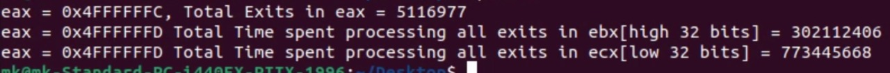

# Assignment 2 
- - NOTE: Please use sudo before make command if you face permission errors. To avoid such issues we can add sudo to makes sure everything works fine.
- - This Readme contains details for Assignment 2.
- **Table of contents**
- - **Assignment 2** 
- - **Questions** answered at the end of readme file.
#  Assignment 2:
## Steps to run the assignment
### Set up the environment:
#### 1.First thing is to build the kernel and before starting the process of building make sure the environment is setup with all the required packages installed.
- - use this link https://askubuntu.com/questions/718381/how-to-compile-and-install-custom-mainline-kernel
- - Next is to run few commands to build the kernel
- - - sudo make -j 6 modules
- - - sudo make -j 6
- - - sudo make modules_install && sudo make install
#### 2. Now the Kernel is build. Reboot the machine using sudo reboot
#### 3. Now we have to make changes to the cpuid.c and vmx.c file.

#### 4. Now we need to install virtual manager and for that we need to install kvm and virt-manager
- - - Use this link to follow steps needed: https://help.ubuntu.com/community/KVM/Installation
- - - Now install virt manager using `sudo apt-get install virt-manager`
- - - Use the link for more details https://help.ubuntu.com/community/KVM/VirtManager
#### 5. Now to check the output, we need a nested vm which we have created in the previous step. Install cpuid package and the test can be done using this package.
#### Screenshots of the outputs

#
#
#
#
# Questions:
## 1.For each member in your team, provide 1 paragraph detailing what parts of the lab that member implemented / researched.
- - I have done it alone.
## 2.Describe in detail the steps you used to complete the assignment. Consider your reader to be someone skilled in software development but otherwise unfamiliar with the assignment. Good answers to this question will be recipes that someone can follow to reproduce your development steps.
- - It is as described in detaild in the above description.
## 3.Comment on the frequency of exits – does the number of exits increase at a stable rate? Or are there more exits performed during certain VM operations? Approximately how many exits does a full VM boot entail?
- - Approximately 3786079. Number of exits are not stable and keeps changing. It depends on the activities performed on VM.
## 4.Of the exit types defined in the SDM, which are the most frequent? Least?
- - Exit 48:EPT Violation, Exit 1: External Interrupt, Exit 30: IO Interrupt, Exit 32:WRMSR -> Most Frequently occuring.
- - Exit 29: MOV DR, Exit 46: Access to IDTR, Exit 55 XSETBV -> Least Frequently occuring. 
